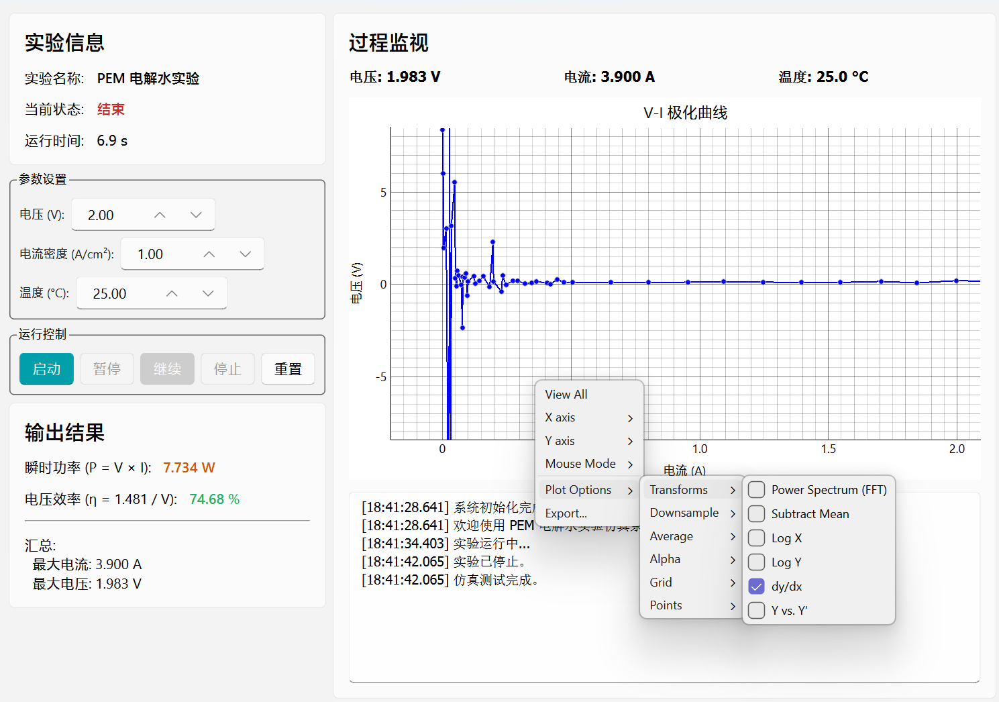
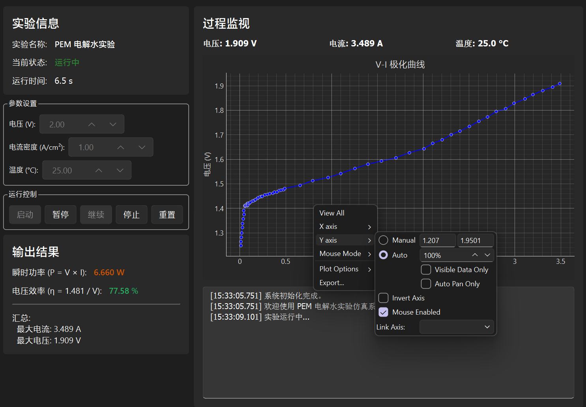
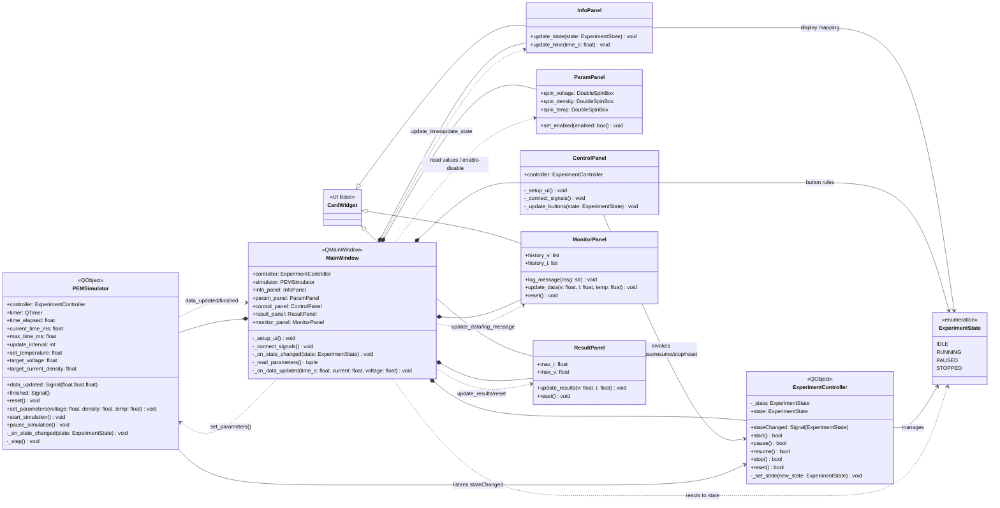

# PEM Water Electrolysis Experiment GUI

This repository contains a PySide6-based application for simulating PEM (Proton Exchange Membrane) water electrolysis experiments. It provides a user-friendly interface for parameter control, real-time data monitoring, and automated result analysis.

## Project Overview

The application simulates standard PEM electrochemical losses, including:
- Theoretical and thermoneutral voltage calculations.
- Activation, ohmic, and mass transport losses.
- Real-time efficiency and power consumption monitoring.





## Getting Started

### Prerequisites

- Python 3.8 or higher.

### Installation

Install the required dependencies using pip:

```bash
pip install PySide6 pyqtgraph numpy pytest mypy ruff
```

### Running the Application

Launch the GUI with the following command:

```bash
python src/main.py
```

## Development and Quality Assurance

### Testing

Run all unit tests to ensure system stability:

```bash
python -m pytest tests/ -v
```

To run only UI tests:

```bash
python -m pytest tests/ui -q
```

### Static Analysis

Ensure code quality with type checking and linting:

```bash
# Type checking
python -m mypy src/ --ignore-missing-imports

# Linting
python -m ruff check src/
```

## Project Structure

- `src/`: Core application logic and UI components.
  - `core/`: Simulation and state machine logic.
  - `widgets/`: Modular UI component implementations.
- `tests/`: Unit and integration test suites.
- `scripts/`: Utility scripts for development and automation.

## UML Class Diagram

The following diagram summarizes the class relationships inside `src/`.


